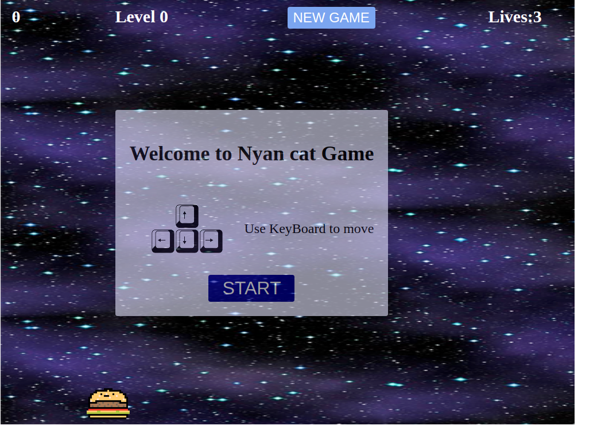

# NYAN KAT Game Project

## 1.The game Introduction: 

In the game, You are the cheeseburger. The thing you can do is move left, right, up and down with the arrows of your keyboard.

The goal of the game is to stay alive as long as possible 
  - by avoiding the Nyan Cats who are raining from the sky and trying to _haz_ you.
  - by taking as much harts as you can who are failling from the sky to have extra lives.
The longer you stay alive, the higher your score but it's not the only way. You can have extra score by hitting stars Bunus You get _+50 extra_;

## 2.The changes:

- Increase the size of the gameboard.
- Add Button `New` to allow the player to start a new game any time of the game.
- Add `Scrore`, `Level` and `Lives` to the Game.
- Add a `sound` track in the beging of the game.
- Add lives : `hart: +1`. The game starts with 3 lives.
- Increase the difficulty level of the game as time passes by adding `extra the enemies` in screen each time the level of the game `5 times`.
- Change the `backgroundImage` of the game when the player reach the `Level 5`and `Level 10`.

- Add `stars` Bonus that will also fall from the sky. Add extra points to the score.
- Add up/down function to allowing the player to move around the screen.
- Add BeginMessage with `start Button` to start a new  game 
- Add FinishMessage with `New Button` to stop music background and go to the Begin message to start over.

## 3. Netlify link:

  - 